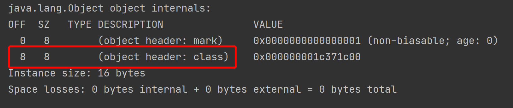

Q：创建一个空对象占多少个字节

A：占用16个字节（前提：64位 HotSpot 虚拟机，开启了指针压缩）

## 验证
### 环境准备


可以看到，JDK8 默认是开启了指针压缩。

### 引入 jar 包

openjdk 给我们提供了一个工具包，可以用来获取对象的信息和虚拟机的信息

> implementation 'org.openjdk.jol:jol-core:0.16'

jol-core 常用的三个方法：

1. 查看对象内部信息
> ClassLayout.parseInstance(object).toPrintable()

2. 查看对象外部信息，包括引用的对象
> GraphLayout.parseInstance(object).toPrintable()

3. 查看对象总大小
> GraphLayout.parseInstance(object).totalSize()

### 简单测试

```kotlin
fun main() {
    println(ClassLayout.parseInstance(Object()).toPrintable())
}
```

直接打印创建一个空的对象，看有什么信息：


可以看到，确实是占用了16个字节，其中12个字节是 object header 对象头（包含8个字节的 mark 和4个字节的 class），还有4个字节是用来对齐的。下面依次解释

### 对象头 object header

通过[官方文档](https://openjdk.org/groups/hotspot/docs/HotSpotGlossary.html)，可以知道 object header 对象头确实是包含了 mark word 和 klass pointer。


#### mark word
mark word 是第一部分信息，通常是一组位域，里面记录了同步状态和身份哈希码，也可以是指向同步相关信息的指针，在 GC 期间，可能包含 GC 状态位。

关于 mark word，在32位和64位的机器中，信息存储也是不一样的，截了一部分[源码信息](https://hg.openjdk.org/jdk/jdk/file/19afeaa0fdbe/src/hotspot/share/oops/markWord.hpp)说明：


在64位系统中：

> normal object，也就是未锁定情况下，哈希码（hash）占用31 bits，分代年龄（age）占用4 bits，偏向模式（biased_lock）占用1 bits，锁标记（lock）占用2 bits，剩余26 bits 未使用。
> 
> biased object，可偏向的情况下，当前线程指针占54 bits，epoch 占2 bits，分代年龄（age）占用4 bits，偏向模式（biased_lock）占用1 bits，锁标记（lock）占用2 bits，剩余1 bit 未使用。

### klass pointer

类指针，是对象指向它的类元数据的指针，虚拟机通过这个指针来确定这个对象是哪个类的实例。占用8个字节（下面演示）。开启压缩类指针后，占4个字节（通过上面打印的信息可以看出来）。

### 对齐

上图其实还有一部分信息，那就是 object alignment gap（对象对齐）。正常来说，一个空的对象创建处理是占用12个字节的，但是为了保证占用大小是8的整数倍，才补了4个字节。

> 为什么要填充对齐至8的倍数？因为 cpu 读取内存数据是按块来的，在64位系统中，一次读取8个字节的数据，如果不对齐，就可能会出现读出来的块里面包含其他对象的信息，这样又要花时间去过滤一遍，这其实也是用空间去换时间。

## 关闭指针压缩

对于klass pointer，上面有说到占用了4个字节，那现在关闭试试看。

> 启动时加个vm参数：-XX:-UseCompressedOops

打印出来的信息：



可以看到占用了8个字节。其实还可以测试对象里面有内容的各种情况，这里就不继续了。

关于压缩指针，其实有两个参数配置

- -XX:+UseCompressedClassPointers：使用压缩类指针

- -XX:+UseCompressedOops：使用压缩普通对象指针

具体区别大家可以查资料看看；但是开了 UseCompressedOops，UseCompressedClassPointers 可开可不开，默认会被打开。
