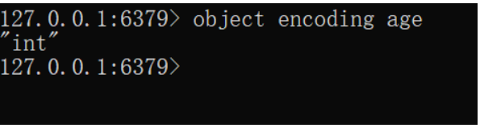

Redis 是一款基于内存的高性能的 key-value 数据库。官方给的数据是：**读-110,000/s**、**写-81,000/s**.
Redis 性能高的原因有很多方面，今天就从其底层丰富的数据结构进行分析。
### RedisObject

Redis 之所以用起来简单，都是因为 RedisObject 的存在，它屏蔽了底层复杂的数据结构，让用户简单几个命令就可以实现自己要的效果。
关于 RedisObject，其结构信息定义如下：

``` 
typedef struct redisObject {
    unsigned type:4;
    unsigned encoding:4;
    unsigned lru:LRU_BITS; /* LRU time (relative to global lru_clock) or
                            * LFU data (least significant 8 bits frequency
                            * and most significant 16 bits access time). */
    int refcount;
    void *ptr;
} robj;
```
下面对各个属性逐一介绍
#### type

type 字段表示对象的类型，占 4 位；

```
#define OBJ_STRING 0 &nbsp; &nbsp;/* String object. */
#define OBJ_LIST 1 &nbsp; &nbsp; &nbsp;/* List object. */
#define OBJ_SET 2 &nbsp; &nbsp; &nbsp; /* Set object. */
#define OBJ_ZSET 3 &nbsp; &nbsp; &nbsp;/* Sorted set object. */
#define OBJ_HASH 4 &nbsp; &nbsp; &nbsp;/* Hash object. */
​
/* The "module" object type is a special one that signals that the object
 * is one directly managed by a Redis module. In this case the value points
 * to a moduleValue struct, which contains the object value (which is only
 * handled by the module itself) and the RedisModuleType struct which lists
 * function pointers in order to serialize, deserialize, AOF-rewrite and
 * free the object.
 *
 * Inside the RDB file, module types are encoded as OBJ_MODULE followed
 * by a 64 bit module type ID, which has a 54 bits module-specific signature
 * in order to dispatch the loading to the right module, plus a 10 bits
 * encoding version. */
#define OBJ_MODULE 5 &nbsp; &nbsp;/* Module object. */
#define OBJ_STREAM 6 &nbsp; &nbsp;/* Stream object. */
```
当我们执行 **type** 命令时，便是通过读取 RedisObject 的 type 属性获得对象的类型。


#### encoding

encoding 表示对象的内部编码，占4位，每个对象有不同的编码实现，Redis 可以根据不同的使用场景来为对象设置不同的编码，大大提高了 Redis 的灵活性和效率。

```
/* Objects encoding. Some kind of objects like Strings and Hashes can be
 * internally represented in multiple ways. The 'encoding' field of the object
 * is set to one of this fields for this object. */
#define OBJ_ENCODING_RAW 0     /* Raw representation */
#define OBJ_ENCODING_INT 1     /* Encoded as integer */
#define OBJ_ENCODING_HT 2      /* Encoded as hash table */
#define OBJ_ENCODING_ZIPMAP 3  /* Encoded as zipmap */
#define OBJ_ENCODING_LINKEDLIST 4 /* No longer used: old list encoding. */
#define OBJ_ENCODING_ZIPLIST 5 /* Encoded as ziplist */
#define OBJ_ENCODING_INTSET 6  /* Encoded as intset */
#define OBJ_ENCODING_SKIPLIST 7  /* Encoded as skiplist */
#define OBJ_ENCODING_EMBSTR 8  /* Embedded sds string encoding */
#define OBJ_ENCODING_QUICKLIST 9 /* Encoded as linked list of ziplists */
#define OBJ_ENCODING_STREAM 10 /* Encoded as a radix tree of listpacks */
```
通过** object encoding** 命令，我们可以查看对象采用的编码方式 ：


#### lru

lru 记录的是对象最后一次被命令程序访问的时间，占24位。

高16位存储的是时间戳，低8位存储访问计数（lfu ： 最近访问次数）
> lru----> 高16位: 最后被访问的时间
> 
> lfu----->低8位：最近访问次数

#### refcount

refcount 记录的是该对象被引用的次数，类型为整型。

refcount 的作用主要在于对象的引用计数和内存回收。
当对象的 refcount > 1时，称为共享对象

Redis 为了节省内存，当有一些对象重复出现时，新的程序不会创建新的对象，而是仍然使用原来的对象。
#### ptr
ptr 属性是一个指针，指向具体的数据，该数据的结构由 type 和 encoding 属性决定。

比如：set name zhangsan，ptr 指向包含字符串 zhangsan 的 sds。

### string
对于string类型，有三种编码方式：int、embstr、raw
-  int

   当一个 key 的 value 是整型且值小于等于long的最大值（9223372036854775807）时，Redis 就将其编码为 int 类型，可以节省内存。


- embstr

  存储小字符串（长度小于等于44）、浮点数


- raw

  当字符串长度大于44或对该元素做了修改操作后（无论长度是否达到44）


***sds***

Redis 的字符串没有直接使用 C 语言的字符数组实现，而是通过 sds（simple dynamic string）简单动态字符串实现的。
其数据结构如下：

```
/* Note: sdshdr5 is never used, we just access the flags byte directly.
 * However is here to document the layout of type 5 SDS strings. */
struct __attribute__ ((__packed__)) sdshdr5 {
    unsigned char flags; /* 3 lsb of type, and 5 msb of string length */
    char buf[];
};
struct __attribute__ ((__packed__)) sdshdr8 {
    uint8_t len; /* used */
    uint8_t alloc; /* excluding the header and null terminator */
    unsigned char flags; /* 3 lsb of type, 5 unused bits */
    char buf[];
};
struct __attribute__ ((__packed__)) sdshdr16 {
    uint16_t len; /* used */
    uint16_t alloc; /* excluding the header and null terminator */
    unsigned char flags; /* 3 lsb of type, 5 unused bits */
    char buf[];
};
struct __attribute__ ((__packed__)) sdshdr32 {
    uint32_t len; /* used */
    uint32_t alloc; /* excluding the header and null terminator */
    unsigned char flags; /* 3 lsb of type, 5 unused bits */
    char buf[];
};
struct __attribute__ ((__packed__)) sdshdr64 {
    uint64_t len; /* used */
    uint64_t alloc; /* excluding the header and null terminator */
    unsigned char flags; /* 3 lsb of type, 5 unused bits */
    char buf[];
};
```
为了灵活的保存不同大小的字符串节省内存空间，Redis 设计了不同的结构头 sdshdr64、sdshdr32、sdshdr16、sdshdr8 和 sdshdr5。
虽然结构头不同，但是除 sdshdr5（never used）外，他们都具有相同的属性：
- len：字符数组buf已经使用的大小，也就是字符串的长度
- alloc：字符数组buf分配的空间大小
- flags：标记SDS的类型：sdshdr64、sdshdr32、sdshdr16、sdshdr8和sdshdr5
- buf[]：字符数组，用于保存字符串

> 一些优化：
Redis使用了**attribute_ (( _packed**))节省内存空间，它可以告诉编译器使用紧凑的方式分配内存，不使用字节对齐的方式给变量分配内存。
关于字节对齐可参考[结构体字节对齐，C语言结构体字节对齐详解](http://c.biancheng.net/view/243.html)。

SDS的优势：
1. C 语言的字符串没有记录自身长度，获取长度需要遍历，时间复杂度为 O(n)；SDS 获取字符串复杂度为 O(1)。
2. 由于 SDS 记录了长度，在可能造成缓冲区溢出时会自动重新分配内存，防止缓冲区溢出。
3. 可以存取二进制数据，以字符串长度 len 来作为结束标识。

   C： \0 表示一个字符串的结束，但某些二进制数据也可能包含\0，所以没有办法完整存储二进制数据。

### list
列表的编码是 quicklist，快速列表
### hash
散列的编码是 hashtable 和 ziplist
- hashtable
  当散列表元素的个数 > 512或者属性字符长度 > 64字节时使用 hashtable 作为编码格式
- ziplist
  当散列表元素的个数 <= 512并且所有属性字符长度都 <= 64字节时使用 ziplist 作为编码格式


关于字符长度大于64的判断：
```
/* Check the length of a number of objects to see if we need to convert a
 * ziplist to a real hash. Note that we only check string encoded objects
 * as their string length can be queried in constant time. */
void hashTypeTryConversion(robj *o, robj **argv, int start, int end) {
    int i;

    if (o->encoding != OBJ_ENCODING_ZIPLIST) return;

    for (i = start; i <= end; i++) {
        if (sdsEncodedObject(argv[i]) &&
            // hash_max_ziplist_value 默认为64
            sdslen(argv[i]->ptr) > server.hash_max_ziplist_value) 
        {
            hashTypeConvert(o, OBJ_ENCODING_HT);
            break;
        }
    }
}
```
元素个数大于512的判断：
```
int hashTypeSet(robj *o, sds field, sds value, int flags) {
    int update = 0;

    if (o->encoding == OBJ_ENCODING_ZIPLIST) {
        unsigned char *zl, *fptr, *vptr;

        zl = o->ptr;
        fptr = ziplistIndex(zl, ZIPLIST_HEAD);
        if (fptr != NULL) {
            fptr = ziplistFind(fptr, (unsigned char*)field, sdslen(field), 1);
            if (fptr != NULL) {
                /* Grab pointer to the value (fptr points to the field) */
                vptr = ziplistNext(zl, fptr);
                serverAssert(vptr != NULL);
                update = 1;

                /* Delete value */
                zl = ziplistDelete(zl, &vptr);

                /* Insert new value */
                zl = ziplistInsert(zl, vptr, (unsigned char*)value,
                        sdslen(value));
            }
        }

        if (!update) {
            /* Push new field/value pair onto the tail of the ziplist */
            zl = ziplistPush(zl, (unsigned char*)field, sdslen(field),
                    ZIPLIST_TAIL);
            zl = ziplistPush(zl, (unsigned char*)value, sdslen(value),
                    ZIPLIST_TAIL);
        }
        o->ptr = zl;

        /* Check if the ziplist needs to be converted to a hash table */
        // hash_max_ziplist_entries 默认为512，大于该值就会转换
        if (hashTypeLength(o) > server.hash_max_ziplist_entries)
            hashTypeConvert(o, OBJ_ENCODING_HT);
    } else if (o->encoding == OBJ_ENCODING_HT) {
       // 省略...
    } else {
        serverPanic("Unknown hash encoding");
    }

    /* Free SDS strings we did not referenced elsewhere if the flags
     * want this function to be responsible. */
    if (flags & HASH_SET_TAKE_FIELD && field) sdsfree(field);
    if (flags & HASH_SET_TAKE_VALUE && value) sdsfree(value);
    return update;
}
```
> ziplist，顾名思义，压缩列表，使用它存储数据能够有效的节省内存空间。
这是因为 ziplist 只保存了上个节点的长度和当前节点的长度，且一个 zipList 对象占用的是一块完整连续的独立内存空间。
> 
> 那为什么在某些条件下会转换成 hashtable？因为对应链表来说，当元素个数太多的时，查找某一个元素需要遍历整个列表，时间复杂度为 O(n)。

### set
集合的编码是整形 intset  和 hashtable
- intset  
  当Redis集合类型的元素都是整数（<=9223372036854775807）并且元素个数小于 512，否则用 hashtable 编码。
- hashtable

 

是否是整数的判断：
```
/* Factory method to return a set that *can* hold "value". When the object has
 * an integer-encodable value, an intset will be returned. Otherwise a regular
 * hash table. */
robj *setTypeCreate(sds value) {
    // 如果新添加的元素是个long型，用intset
    if (isSdsRepresentableAsLongLong(value,NULL) == C_OK)
        return createIntsetObject();
    return createSetObject();
}
```
元素个数超过默认值时（512）的转换：
```

int setTypeAdd(robj *subject, sds value) {
    long long llval;
    if (subject->encoding == OBJ_ENCODING_HT) {
        dict *ht = subject->ptr;
        dictEntry *de = dictAddRaw(ht,value,NULL);
        if (de) {
            dictSetKey(ht,de,sdsdup(value));
            dictSetVal(ht,de,NULL);
            return 1;
        }
    } else if (subject->encoding == OBJ_ENCODING_INTSET) {
        if (isSdsRepresentableAsLongLong(value,&llval) == C_OK) {
            uint8_t success = 0;
            subject->ptr = intsetAdd(subject->ptr,llval,&success);
            if (success) {
                //** 能用long表示
                //** 当元素个数超过set_max_intset_entries(默认512)时，转换成 hashtable
                if (intsetLen(subject->ptr) > server.set_max_intset_entries)
                    setTypeConvert(subject,OBJ_ENCODING_HT);
                return 1;
            }
        } else {
            //** 不能用 long 表示，进行类型转换
            setTypeConvert(subject,OBJ_ENCODING_HT);

            /* The set *was* an intset and this value is not integer
             * encodable, so dictAdd should always work. */
            serverAssert(dictAdd(subject->ptr,sdsdup(value),NULL) == DICT_OK);
            return 1;
        }
    } else {
        serverPanic("Unknown set encoding");
    }
    return 0;
}
```
### zset
有序集合的编码是压缩列表和跳跃表
- ziplist
  元素个数少于等于128个且所有元素字符长度小于等于64
- skiplist
  元素个数大于128或存在元素其字符长度大于64


### 最后
关于底层的数据结构：quicklist、ziplist、hashtable、skiplist、intset 等，后面再单独介绍了。
